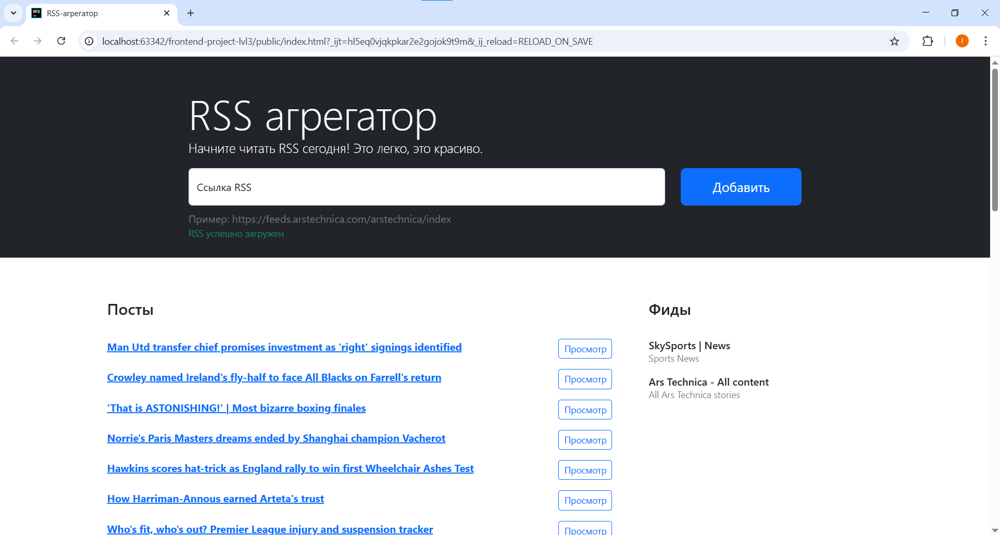
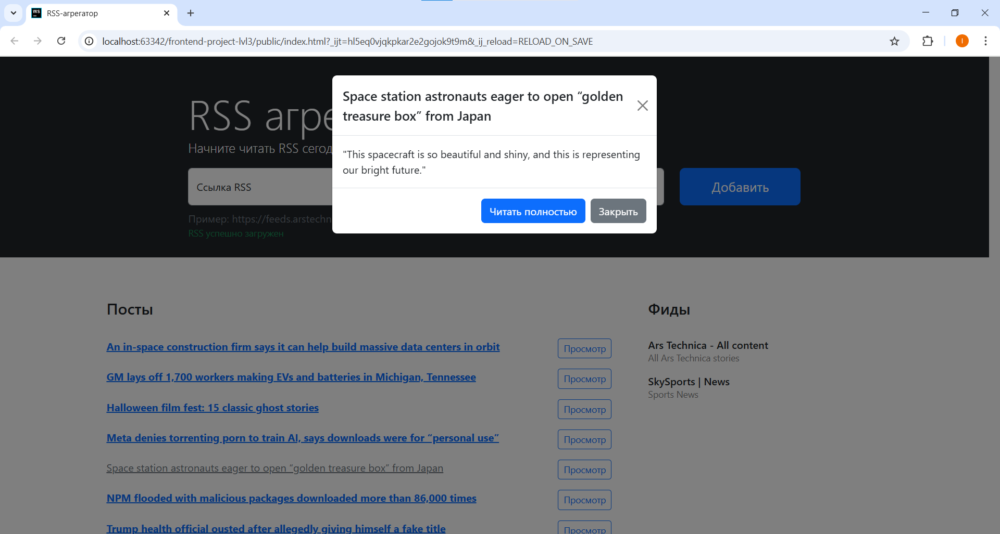

[](https://codeclimate.com/github/Frit027/frontend-project-lvl3/maintainability)
[](https://github.com/Frit027/frontend-project-lvl3/actions)

<h1>
    <div align="right">
        <a href="README.md"></a>
        <code><a href="#"></a></code>
    </div>
    RSS aggregator
</h1>

## Описание
Веб-сайт представляет собой [RSS-агрегатор](https://ru.wikipedia.org/wiki/RSS-агрегатор), который принимает ссылку на
RSS-ресурс и загружает все доступные новости.  
Новые посты из добавленного потока динамически появляются на странице.  
Пользователь может прочитать как превью новости через модальное окно, так и перейти в оригинальную новость по ссылке.

## Доступ
Веб-сайт доступен по ссылке: https://frontend-project-lvl3-jade-one.vercel.app

#### Примеры RSS-потоков для демострации работы приложения
https://feeds.arstechnica.com/arstechnica/index - Новости про информационные технологии  
https://lorem-rss.herokuapp.com/feed?unit=second - Обновления каждую секунду

## Примеры работы веб-приложения
#### Загруженные RSS-потоки
На главной странице есть только одно поле для ввода URL. С помощью него можно добавлять RSS-потоки.



#### Модальное окно
Используя модальное окно, можно ознакомиться с кратким содержанием новости.



## Зависимости
**Node.js** v12.22.9 или более новая версия.

## Установка и использование
Клонируйте данный репозиторий.  
В корне проекта выполните следующие команды:
```console
npm i
npm run build
```
Из созданной директории `public` откройте файл `index.html` в браузере.

## Используемые технологии и инструменты
### Основные
- [Javascript ES6](https://www.w3schools.com/js/js_es6.asp)
- [Bootstrap](https://getbootstrap.com) `[5.0]`
### Сборщик кода
- [webpack](https://webpack.js.org) `[5.74.0]`
